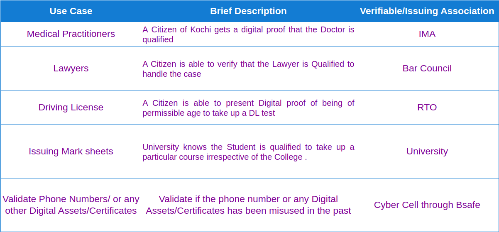
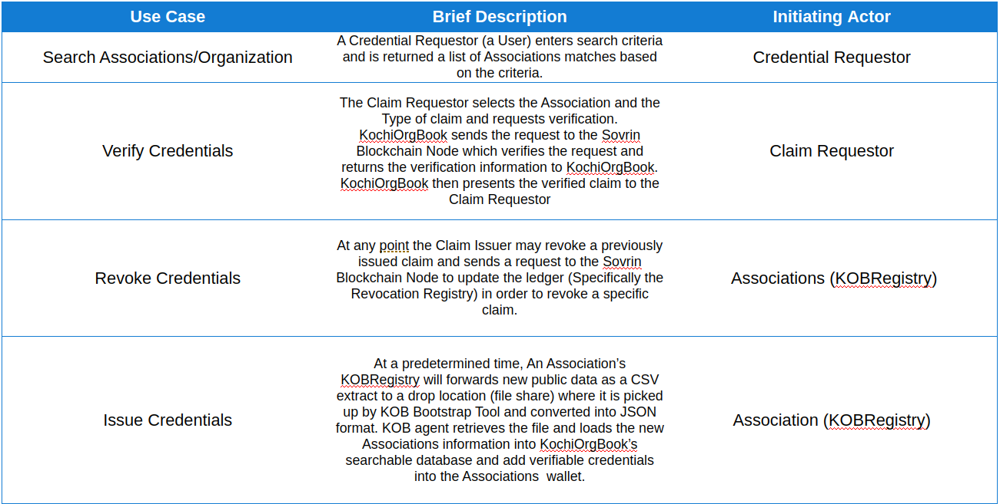
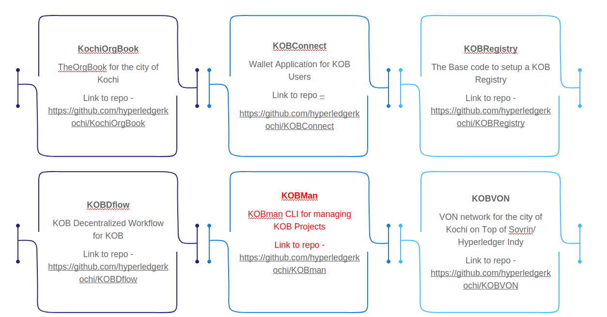

# KochiOrgBook

## Table of Contents

1. Overview
2. Key Use Cases
   1. Medical Practitioners
   2. Lawyers
   3. Driving License
   4. Verification services to provide specific digital identities
   5. Creating student credentials for applying admission to external Universities
   6. University issued digital credential
3. Generic Use Cases
4. KochiOrgBook – Community project initiative for the City of Kochi​
5. KochiOrgBook sub projects​
6. Community groups

## Overview

KochiOrgBook is a **Verifiable Organization Network** for the city of Kochi. It is a technology demonstrator to launch a [DID](https://github.com/hyperledgerkochi/KochiOrgBook/blob/master/Glossary.md#did--decentralized-identifier) based utility compliant with the [ToIP](https://github.com/hyperledgerkochi/KochiOrgBook/blob/master/Glossary.md#toip--trust-over-ip-foundation) standards to enable Trusted digital verification service for various association within the city of Kochi.​

The objective of this initiative was to enable business entities to avail permits or licenses from Government in a transparent and efficient manner and in the current form it may not be feasible for an ordinary citizen to confirm if these association are valid or not due to chance of forgery of documents and we often trust the documents they present making it quite easy to misguide anyone.

With KochiOrgBook each association will now be able to present cryptographically encrypted digital credential which has been issued to them from a trusted entity and can 
be verified by any citizen of Kochi using their mobile [wallet app](https://github.com/hyperledgerkochi/KochiOrgBook/blob/master/Glossary.md#toip--trust-over-ip-foundation).

In the current sceanrio, for a citizen to avail any service or to prove their eligibility or identity, they have to provide a number of documents. Often the whole process 
takes time and a lot of effort.

This utility aims to cut down the red tape and improve the overall efficiency of the current processes.

## Key Use Cases 

This initiative can work around a number of use cases under a particular jurisdiction. A few of the key use cases are listed below.

1. Medical Practitioners
   
   **Verifiable/Issuing Association - IMA(Kochi Chapter)**

   Nobody can take risks when it comes to health. So, when someone is suffering from a health related issue, he/she will, most probably, consult an experienced and well renowned doctor. We usually ask our friends/relatives for recommendations on a good doctor or visit the highly rated hospital. Sometimes we even consult more than one doctor to get a second opinion regarding one's health issue. This practise can be time consuming and can be tiring as well. There are situations were the treatment should be given on time and in such a situation, this practise should not be followed.

   With KochiOrgBook, doctors will be issued a digital identity about who they are and what their qualification is and a normal citizen can access these informations from their fingertips. With this, an individual can make the best decisions on time and with ease.

2. Lawyers
   
   **Verifiable/Issuing Association - Bar Council of India(Kochi High Court Chapter)**

   It is quite difficult to identity lawyers who are specialized in specific types of cases from public information as only their name and qualifications are made available. All lawyers may not be able to offer legal consultation services which makes it difficult for a citizen to approach the right lawyer without connections. This could take time and may impact the ability of an individual to contest legal claims at court efficiently.

   This use case is focused on enabling a citizen of the city of Kochi to verify that the Lawyer is qualified to handle or offer legal consultation on specific types of cases in a most efficient and trustworthy manner.

3. Driving License​
   
   **Verifiable/Issuing Association - Regional Transport Office(Kochi)**

   Anyone who needs to take up the driving license test should first prove their eligibility, mainly age. Other than age, one should give proof for their identity and address. Then the RTO department goes through the presented documents and declare one eligible, if they approve of it. This entire process can take up a lot of time and individuals will have to provide a number of documents to prove their eligibility and identity.

   This use case is focused on enabling a citizen to present digital proofs to take up driving license test leveraging capabilities of [verifiable credentials](https://github.com/hyperledgerkochi/KochiOrgBook/blob/master/Glossary.md#toip--trust-over-ip-foundation) and increase efficiency of the process.

4. Verification services to provide specific digital identities
   
   **Services - Email verification service, Phone number verification service, Address verification service**
   
   Today, email-id and phone number are the most shared information throughout the internet. A person use their email-id/phone number to avail various services or share information or login to a particular website. But, even these credentials are misused for various illegal activities.

   This use case is focused on providing individual with basic verification services like Email verification service, Phone number verification service etc. With this each user can prove their ownership over their informations like email-id/phone number and they will be provided with a DID for these information which can be stored in a digital wallet app. 

5. Creating student credentials for applying admission to external Universities

   **Verifiable/Issuing Association - Universities and Educational Institutions (Kochi)**
   
   Often a student will have to share multiple credential information for applying admission to external universities. The student would need to apply and secure many of these credentials from different source independently. Not every student may be well versed with the formalities involved this and this results in students incurring delays and cost for securing all the required credentials for applying to external Universities. Lack of transparency in the process also causes some students to miss out on the requesting credentials in specific format which forces them to miss out on apply for admissions.

   This use case is focused on enabling a student to collect all required digital credentials /proofs and submit them in a timely manner leveraging a workflow which offers transparency, enhance efficiency, and reduces cost to apply for admissions.

6. University issued digital credential
   
   **Verifiable/Issuing Association - Universities and Educational Institutions (Kochi)**

   In this use case, a student under a particular university will be issued a DID proving him/her a valid student under the university. By leveraging this DID, he/she can work through the university related processes with ease.

## Generic Use Cases

   
## KochiOrgBook – Community project initiative for the City of Kochi​

## KochiOrgBook sub projects​

## Community groups

   

   
   

