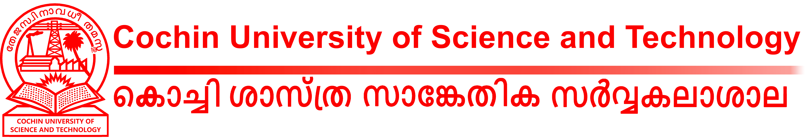

# KOB Mentorship Program Jan 2021 - June 2021

KOB mentorship program was conducted as a part of the MOU signed between **KochiOrgBook(KOB)** and **Cochin University of Science and Technology(CUSAT)**.
 
 
 Ten students from CUSAT were taken in as contributors for projects under the KOB umbrella. Each contributor selected a particular project from the KOB umbrella and contributed individually to it under the guidance of 3 mentors from Wipro. 
 

