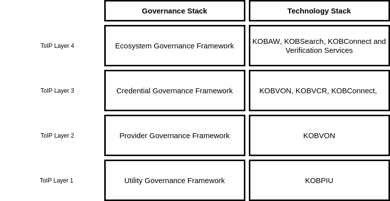

##  KOB Workflow Diagram

The below diagram shows the interaction between the projects under KOB.
   

## KOB as ToIP stack

The below diagram shows the co-relation between ToIP stack and the projects under KOB.
   

### Layer 1

Layer 1 is for underlying infrastructure and it will be governed by KOB Consortia.

### Layer 2

Layer 2 is for tools and utilities to onboard service providers and for enabling their services as well as enrolling of members.

### Layer 3

The credential exchange mechanism happens at Level 3. This is where the interactions between Issuer, Holder and Verifier take place.

### Layer 4

This layer contains the entire digital ecosystem applications. Human interactions happen at this layer. It will be governed by ecosystem governance framework.