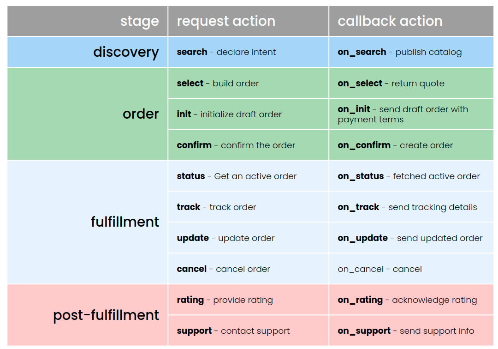
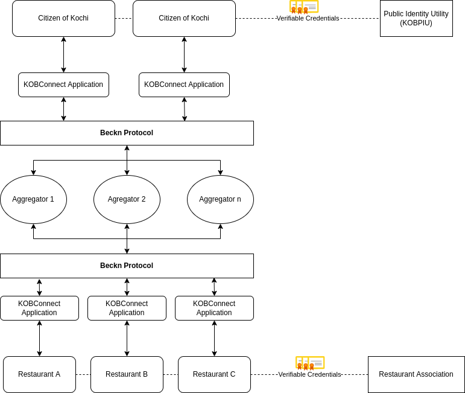

# KOB - Beckn Food Delivery Platform

## What is Beckn Protocol

Beckn protocol is a set of specifications consisting of APIs, data models, reference architecture, transaction mechanisms, and global standards that when adopted by digital platforms, enable the creation of decentralized networks. Such networks allow consumers and providers to discover, identify each other and perform transactions with each other without the need for a central intermediary. It can be thought of as a common set of rules of communication mutually agreed upon by several platforms to allow their users to perform discovery, ordering, fulfilment and post-fulfilment activities between each other in a standard way. It is a sector-agnostic protocol, meaning, any industry-specific taxonomy or knowledge model can be represented using the data model of beckn protocol.

### Beckn Protocol - Order Lifecycle

## Stakeholders Involved

- Citizens of Kochi.
- Associations
    - Restaurants' Association (Kochi chapter)
- DSP
    - Aggregators/Registries - Inventory provider for restaurants in Kochi.
    - Logistics Provider Network - Focuses on final mile delivery.
    - Reputation Management System - Manages post fulfillment phase such as ratings, reviews etc.

## Workflow

