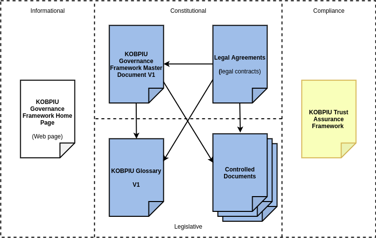

## Preface

This is an official document of the KochiOrgBook Public Identity Utility Governance Framework​ ("KOBPIU-GF"). If you have comments or suggestions, we invite you to submit them using our issue tracker. If you are interested in joining the KOB Consortium, please feel free to contact us.

## Version Control

- Version: 0.1
- Governing Board Approval Date: TBD
- Comments: Ratification of the KOBPIU-GF will take place upon the formation of the Governing Board (at first meeting).
- Status: TBD

## Acknowledgements

​This document was produced on behalf of the KOBPIU Governing Board by the KOBPIU Governance Framework Working Group.

## KOBPIU Governance Framework Master Document

### **1. INTRODUCTION**
The purpose of the KOBPIU is to provide a decentralized global public utility for trusted commerce. The KOBPIU-GF works as the constitution for the KOBPIU. It represents an instance of a [ToIP Layer One Public Utility Governance Framework](https://trustoverip.org/working-groups/governance-stack/) under the guidance of the [ToIP Utility Foundry Working Group](https://trustoverip.org/working-groups/utility-foundry/).

The KOBPIU-GF leverages the principles, policies, terminology, and standards necessary to enable trusted digital commerce based on decentralized identity.

A key objective of the KOBPIU-GF is to address any concerns or risks that consortium members may have as itility participants.

The KOBPIU-GF formally consists of a set of interrelated documents shown in blue and yellow in Figure(). The KOB Consortia will also publish additional operational documents, including white papers, FAQs, readiness checklists, design guidelines, sample schemas, etc., as needed. 

The documents are organized in three categories; Blue = Normative, Yellow = Assessment, White = Informative.

The normative documents in the KOBPIU-GF V1 are:

- **KOBPOIU Governance Framework Master Document V1** - The present document.
- Five legal agreements:
    - **KOBPIU Steward Agreement V1** — The agreement between the KOB Consortia and all Stewards who operate Nodes of the KOBPIU.
    - **Transaction Author Agreement V1** — The agreement between the KOB Consortia and all Identity Owners writing Transactions to the KOBPIU Ledger Networks.
    - **Transaction Endorser Agreement V1** — The agreement between the KOB Consortia and Organizations using Permissioned Write Access.
    - **Steward Data Processing Agreement (DPA) V1** — The agreement under which Stewards serve as data processors from a data protection regulatory standpoint.
    - **Transaction Endorser Data Processing Agreement V1** — The DPA that applies to Transaction Endorsers.
- **KOBPIU Glossary V1** — The terminology and definitions that apply to all KOBPIU-GF documents and across KOBPIU infrastructure as a whole.
- **Controlled Documents** — Technical specifications, standards, and policies that are independently maintained and versioned either by the KOB Consortia (e.g., the KOBPIU **(TODO:-Change back)** DID Method) or external standards bodies (e.g., W3C, OASIS).

Another document, the **KOBPIU Trust Assurance Framework**, does not directly govern KOBPIU Infrastructure; rather it defines criteria and processes for assessing conformance of KOBPIU actors, including the KOB Consortia, to the policies of the KOBPIU-GF.

### **2. CORE PRINCIPLES**

The following principles guide the development of policies in the KOBPIU-GF

#### **2.1 Self-Sovereignty**

Individuals are endowed with and possess an inalienable right to be Identity Owners with the ability to permanently control one or more Self-Sovereign Identities without reliance on any external administrative authority.

  1. An Identity Owner alone shall determine which Identity Data describe its Identities.
  2. With regard to managing its own Identity Data, an Identity Owner alone shall determine how and for what purpose(s) it is processed.
  3. An Identity Owner alone shall determine who has access to its Identity Data.
  4. An Identity Owner’s Identity Data shall be portable as determined by the Identity Owner and enabled via Open Standards.
  5. An Identity Owner alone shall have the right to Delegate control of these functions.
   
#### **2.2 Guardianship**

An Individual who does not have the capability to directly control that Individual’s Identity Data (a Dependent) shall have the right to appoint another Identity Owner who has that capability (an Independent or an Organization) to serve as the owner’s Guardian. If a Dependent does not have the capability to directly appoint a Guardian, the Dependent shall still have the right to have a Guardian appointed to act on the Dependent’s behalf. A Dependent has the right tobecome an Independent by claiming full control of the Dependent’s Identity Data. A Guardian has the obligation to promptly assist in this process provided the Dependent can demonstrate that the Dependent has the necessary capabilities. Guardianship shall not be confused with Delegation or Impersonation. Guardianship under the KOBPIU Governance Framework should be
mapped in the proper contexts to various legal constructs, including [legal guardianship](https://en.wikipedia.org/wiki/Legal_guardian), [power of attorney](https://en.wikipedia.org/wiki/Power_of_attorney), [conservatorship](https://en.wikipedia.org/wiki/Conservatorship), [living trusts](https://en.wikipedia.org/wiki/Trust_law), and so on.

#### **2.3 Openness and Interoperability**

KOBPIU Infrastructure shall use Open Standards and avoid mechanisms that would prevent Identity Owners from having interoperability or portability of their Identity Data both within the KOBPIU Network and with other networks and systems.

#### **2.4 Accountability**

Identity Owners shall be accountable to each other for conformance to the purpose, principles, and policies of the KOBPIU Governance Framework. All KOBPIU Entities shall be responsible for and be able to demonstrate compliance with any other requirements of applicable law. Nothing in the KOBPIU Governance Framework shall require a KOBPIU Entity to breach applicable law in order for it to perform its obligations under the KOBPIU Governance Framework.

#### **2.5 Sustainability**

KOBPIU Infrastructure shall be designed and operated to be technically, economically, socially, and environmentally sustainable for the long term.

#### **2.6 Transparency**

The KOB Consortia shall practice Open Governance, and the KOB Consortia and the Stewards in their KOBPIU Ledger Roles shall operate with full openness and transparency to the greatest extent feasible consistent with the principles herein, including the proceedings of the KOBPIU Board of Trustees and all KOBPIU Governing Bodies, the development and distribution of KOBPIU Open Source Code, the qualification and operation of Stewards, and any revisions to the KOBPIU Governance Framework.

#### **2.7 Collective Best Interest**

The KOB Consortia shall act in the collective best interests of all Identity Owners and shall not favor the interests of any single Identity Owner or group of Identity Owners over the interests of the KOB Consortia as a whole. *Note that at present the KOBPIU Governance Framework has no self-enforcing distributed mechanism that neutralises differences of interest among different stakeholders participating in the network, therefore this is the responsibility of the KOB Consortia. Future versions of the KOBPIU Governance Framework shall aim to provide such mechanisms.*

#### **2.8 Decentralization by Design**

##### 2.8.1 General

KOBPIU Infrastructure shall be [decentralized](https://en.wikipedia.org/wiki/Decentralization) to the greatest extent possible consistent with the other principles herein. As the business, legal, and technical limitations of decentralization may change over time, the KOB Consortia shall continuously examine all points of control, decision, and governance to seek ongoing conformance with this principle.

##### 2.8.2 Diffuse Trust

KOBPIU Infrastructure shall not concentrate power in any single Individual, Organization, Jurisdiction, Industry Sector, or other special interest to the detriment of the Network as a whole. Diffuse Trust shall take into account all forms of diversity among Identity Owners.

##### 2.8.3 Web of Trust

KOBPIU Infrastructure shall be designed to not favor any single root of trust, but empower any KOBPIU Entity to serve as a root of trust and enable all KOBPIU Entities to participate in any number of interwoven Trust Communities.

##### 2.8.4 Censorship Resistance

KOBPIU Infrastructure shall be designed to resist censorship of any Entity while remaining compliant with all applicable laws.

#####  2.8.5 High Availability

KOBPIU Infrastructure shall be designed and implemented to maximize availability of the KOBPIU Network.

##### 2.8.6 No Single Point of Failure

KOBPIU Infrastructure shall be designed and implemented to not have any [single point of failure](https://en.wikipedia.org/wiki/Single_point_of_failure).

##### 2.8.7 Regenerative

KOBPIU Infrastructure shall be designed so that failed components can be quickly and easily replaced by other components.

##### 2.8.8 Distributive

KOBPIU Infrastructure shall be designed and implemented such that authority is vested, functions performed, and resources used by the smallest or most local part of the KOB Consortia that includes all relevant and affected parties. Deliberations should be conducted and decisions made by bodies and methods that reasonably represent all relevant and affected parties and are dominated by none.

##### 2.8.9 Innovation at the Edge

The continued development of the KOBPIU Infrastructure shall encourage innovation to take place at the edges of the network among the members of the KOB Consortia most directly involved or impacted.

#### **2.9 Inclusive by Design**

##### 2.9.1 General

The design, governance, and operation of KOBPIU Infrastructure shall follow the principles of [Inclusive Design](http://www.inclusivedesigntoolkit.com/whatis/whatis.html) to serve the widest possible community of Identity Owners.

##### 2.9.2 Identity for All

Consistent with the [United Nations Sustainable Development Goal 16.9](https://sdgs.un.org/goals/goal16) , the KOB Consortia and the KOBPIU Network shall promote peaceful and inclusive societies for sustainable development; enable access to justice for all; and facilitate effective, accountable, and inclusive institutions at all levels by being accessible to, and inclusive of all Identity Owners without discrimination and with accommodation for physical, economic, or other limitations of Identity Owners to the greatest extent feasible.

##### 2.9.3 People-Centered Design

KOBPIU Developers shall put people at the heart of the design process and enable them to control their own user experience.

##### 2.9.4 Design for Difference

KOBPIU Developers shall strive to understand differences in capabilities and preferences across all potential members of the KOB Consortia and provide adaptable solutions to meet the needs of all potential members.

##### 2.9.5 Test Across Contexts

KOBPIU Developers shall test KOBPIU solutions for use in different Identity Owner environments and contexts.

##### 2.9.6 Offer Choice

KOBPIU Developers shall design flexibility by offering a choice of ways to achieve the same outcome.

##### 2.9.7 Maintain Consistent Experience

KOBPIU Developers shall design comparable experiences for all of their user communities that use consistent design elements and language.

#### **2.10 Privacy by Design**

##### 2.10.1 General

The design, governance, and operation of KOBPIU Infrastructure shall follow the [Seven Foundational Principles of Privacy by Design](https://www.ipc.on.ca/wp-content/uploads/Resources/7foundationalprinciples.pdf) to the greatest extent possible consistent with the other principles herein. These principles can be summarized as:

  1. Proactive not Reactive; Preventative not Remedial
  2. Privacy as the Default Setting
  3. Privacy Embedded into Design
  4. Full Functionality—Positive-Sum, not Zero-Sum
  5. End-to-End Security—Full Lifecycle Protection
  6. Visibility and Transparency—Keep it Open
  7. Respect for User Privacy—Keep it User-Centric

##### 2.10.2 Pairwise Pseudonyms by Default

Agents using the KOBPIU Protocol  shall default to assigning Pairwise Pseudonyms, Pairwise Public Keys, and, when necessary, Pairwise Service Endpoints whenever forming a Connection unless specifically directed otherwise by an Identity Owner.

##### 2.10.3 Selective Disclosure by Default

Issuers, Holders, and Verifiers using the KOBPIU Protocol  shall default to issuing, holding, and accepting Credentials that support Zero-Knowledge Proofs and privacy-respecting Revocation Registries by default.

##### 2.10.4 Governance Framework Disclosure by Default

KOBPIU Entities shall by default disclose the Governance Framework under which a Connection is created, an Interaction is performed, or a Credential is exchanged. Agents shall by default notify their Identity Owner of any conflict between the Identity Owner’s privacy preferences and the Governance Framework’s privacy policies.

##### 2.10.5 Owner Controlled Storage by Default

Agents shall store Private Data in decentralized data storage controlled by the Identity Owner by default.

##### 2.10.6 Anti-Correlation by Design and Default

KOBPIU Infrastructure shall be designed and implemented to avoid correlation of an Identity Owner, or of a Thing associated with an Identity Owner, without the direct knowledge and informed consent of the Identity Owner.

##### 2.10.7 Guardian and Delegate Confidentiality

The use of a Guardian or Delegate may be confidential information and shall only be disclosed with the authorization of the Identity Owner and of the Guardian and/or Delegate.

#### **2.11 Security by Design**

##### 2.11.1 General

The design, governance, and operation of KOBPIU Infrastructure shall follow the principles of [Security by Design](https://en.wikipedia.org/wiki/Secure_by_design) to the greatest extent feasible consistent with the other principles herein.

##### 2.11.2 System Diversity

The process and policies for selecting Stewards shall optimize availability and security by maximizing diversity of hosting locations, environments, networks, and systems.

##### 2.11.3 Secure Defaults

The default configuration settings and user experience of the applications using KOBPIU Infrastructure shall enforce strong protection by default, including encryption by default.

##### 2.11.4 Least Privilege

Access and authorization of the applications, Agents, and network services that use and comprise KOBPIU Infrastructure shall subscribe to the concept of [least privilege](https://en.wikipedia.org/wiki/Principle_of_least_privilege).

##### 2.11.5 Anti-Impersonation

Applications shall be designed to not knowingly allow any party other than the Identity Owner to act as (impersonate) the Identity Owner. Impersonation does not include Guardianship or Delegation.

##### 2.11.6 Auditability

Transactions in KOBPIU Infrastructure and actions of application using KOBPIU Infrastructure that require auditing shall be immutably logged, in a tamper-evident way, and be available to verify processing.

##### 2.11.7 Secure Failure

Applications using KOBPIU Infrastructure shall be designed to take an exception or error path that will not create a security weakness exploitable by bad actors.

##### 2.11.8 Pervasive Mediation

Applications using KOBPIU Infrastructure shall not assume authorization is transitive across time and/or space—rather security mechanisms shall check every access to every object, and authorize each action on its own merits, just in time.

#### **2.12 Data Protection by Design and Default**

##### 2.12.1 General

KOBPIU Entities, in the processing of personal data, shall adhere to the following data protection principles to the greatest extent feasible consistent with the other principles herein.

##### 2.12.2 Lawfulness, Fairness, and Transparency

Personal data must be processed lawfully, fairly, and in a transparent manner in relation to the Individual.

##### 2.12.3 Purpose Limitation

Personal data must be collected for specified, explicit, and legitimate purposes and not further processed in a way incompatible with those purposes; further processing for archiving purposes in the public interest, or scientific and historical research purposes or statistical purposes, shall not be considered incompatible with the original processing purposes.

##### 2.12.4 Data Minimization

Personal data must be relevant and limited to that which is necessary in relation to the purposes for which it is being processed.

##### 2.12.5 Accuracy
Personal data must be accurate and, where necessary, kept up to date. Every reasonable step must be taken to ensure that where personal data is inaccurate it is erased or rectified without delay.

##### 2.12.6 Storage Limitation

Personal data must be kept in a form which permits identification of Individuals for no longer than the duration necessary for the purposes for which the personal data is being processed.

##### 2.12.7 Integrity and Confidentiality

Personal data must be processed in a manner that provides appropriate security of the personal data, including protection against unauthorized or unlawful processing and against accidental loss, destruction, or damage, using appropriate technical or organizational measures (i.e., information security)

### **3 CORE POLICIES**

#### **3.1 Stewardship**
In keeping with all Core Principles and especially the Decentralization by Design and Security by Design principles:
  
  1. Policies, practices, procedures, and algorithms governing participation of Stewards and operation of Nodes MUST follow all Core Principles.
  2. The KOB Consortia MUST publish the following Controlled Documents managed as specified by KOB Consortia :
   
    a. KOBPIU Steward Business Policies
   
    b. KOBPIU Steward Technical Policies.
   
    c. KOBPIU Ledger Access Policies.

#### **3.2 Guardianship**

In keeping with the Guardianship principle, a Guardian SHOULD:

  1. Act in the Dependent person’s best interest.
  2. Exercise good judgment and carefully manage responsibilities.
  3. Avoid commingling—keep Dependent’s property separate (e.g., separate DIDs, Public Keys, Wallets, Vaults, etc.).
  4. Keep detailed records of all actions taken on behalf of the Dependent.
  5. Not violate the Anti-Impersonation principle (section 2.11.5).
  6. Be subject to applicable legal structures regarding the granting and revocation of Guardianships.
   
#### **3.3 Inclusion**

In keeping with the Inclusive by Design principles:
  
  1. Access to the KOBPIU Network MUST be open to all Individuals and Organizations on a comparable basis without intentional exclusion of specific persons or communities.
  2. Developers SHOULD design for different capabilities in different contexts considering:
   
    a. Digital Exclusion (e.g., access to connected devices)

    b. Physical or Cognitive Exclusion (e.g., disability or incapacity)

    c. Political & Social Status (e.g., stateless individuals; being a child or a woman)

    d. Financial Status (e.g., having no income)

    e. Literacy & Language (e.g., low literacy or not speaking local language)

#### **3.4 Trust Assurance**

In keeping with all Core Principles and especially the Decentralization by Design principles:

  1. The KOB Consortia MUST specify policies, practices, and procedures for assessing conformance to the KOBPIU Governance Framework by publishing and maintaining the
  KOBPIU Trust Assurance Framework as a Controlled Document managed as specified by KOBPIU Governing Bodies.
  2. The KOBPIU Governance Framework MUST be designed to provide a foundation for Domain-Specific Governance Frameworks (DSGFs) based on the KOBPIU Web of TrustModel. 
  3. As soon as feasible, the KOBPIU Foundation MUST publish a DSGF, the KOBPIU Web of Trust Governance Framework, whose purpose is to enable decentralized discovery,navigation, and verification of DSGFs.
  4. The KOBPIU Foundation MUST publish the KOBPIU Trust Mark Policies as a Controlled Document managed as specified by KOBPIU Governing Bodies.
  5. An Entity serving in one of the KOBPIU Infrastructure Roles who meets the requirements in the KOBPIU Trust Assurance Framework MAY use the appropriate KOBPIU Trust Mark as specified in KOBPIU Trust Mark Policies.

#### **3.5 Economics**

In keeping with the Sustainability principle:

  1. The KOB Consortia MUST publish the KOB Economic Policies as a Controlled Document managed as specified by KOBPIU Governing Bodies in conjunction with KOB Foundation legal counsel.
  2. The KOB Consortia MUST manage Ledger Fees and any mechanism used for paying them to ensure economic viability and sustainability for KOBPIU Infrastructure in
  keeping with its charter as a non-profit public trust organization.
  3. The KOB Consortia MUST retain a qualified Auditor to publish an annual public audit of KOBPIU Foundation finances.
   
        Note: KOB Consortia or KOBPIU Foundation?

### **4 GOVERNANCE**

The KOBPIU Governance Framework Master Document and the Controlled Documents listed in Appendix A shall be revised from time to time as KOBPIU Infrastructure grows and evolves. The policies in this section govern this process.

#### **4.1 General**

1. The KOB Consortia MUST publish KOB Governance Bodies as a Controlled Document managed by the KOB Board of Trustees.
2. KOB Governance Bodies MUST specify the KOB Governing Body for each Controlled Document.
3. All KOBPIU Governance Framework documents, including Controlled Documents, MUST use keywords in policies as defined in [IETF RFC 2119](https://tools.ietf.org/html/rfc2119).
4. All KOBPIU Governance Framework documents MAY be revised to add non-normative content, such as references to appendices, white papers, or other explanatory materials,
without triggering a formal revision review process as defined in this section 4.

#### **4.2 Revisions to the KOBPIU Governance Framework Master Document**

These policies apply to any normative revision to the present document, exclusive of Appendix A.

   1. Revisions to the KOBPIU-GF Master Document MUST respect the Purpose and Core Principles.
   2. The commencement of any revision process MUST be publicly announced by the KOB Foundation no later than the time of commencement.
   3. Participation in the revision process MUST be available to all members of the KOB Community.
   4. Proposed revisions MUST be publicly announced by the KOB Foundation and subject to a minimum 30 day public review period following the announcement.
   5. Revisions MUST be approved by a supermajority vote of at least two-thirds of the KOB Board of Trustees after the conclusion of the public review period and before the revision takes effect.
   6. Prior to the next major revision of the KOBPIU-GF Master Document, the KOB Foundation MUST put in place new governance policies implementing the KOBPIU Decentralization by Design principles.

#### **4.3 Revisions to Controlled Documents**

These policies apply to any normative revision to the Controlled Documents listed in Appendix A.

1. The list of Controlled Documents in Appendix A, as well as each Controlled Document on that list, MAY be revised independently from the KOBPIU Governance Framework
Master Document (the present document).
2. A Controlled Document MUST be stored in and use the change control mechanisms established by the official KOBPIU Code Repository  at the permanent location for the document published in Appendix A.
3. Proposed revisions MUST be subject to a minimum 30 day public review period publicly announced by the KOBPIU Foundation.
4. Revisions to a Controlled Document MUST be approved by the KOBPIU Board of Trustees after the conclusion of the public review period and before the revision takes effect.

### **TODO: Appendix A**