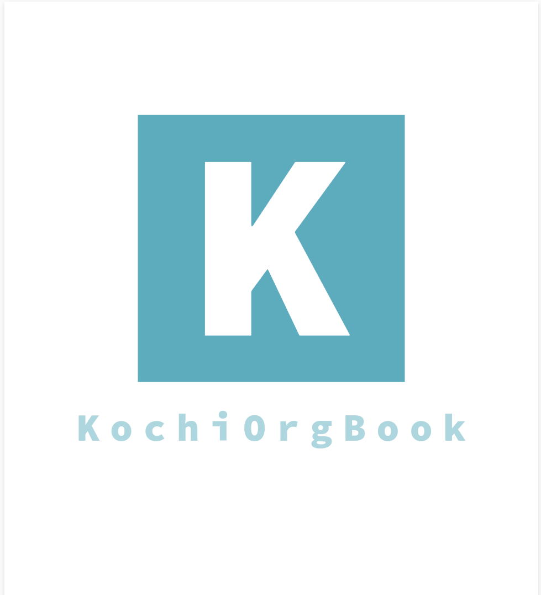

# KochiOrgBook

## Overview

KochiOrgBook(KOB) is a [Digital Trust Ecosystem](./gf_controlled/glossary.md#digital-trust-ecosystem) project for the city of Kochi. 

KOB includes a [Decentralised Identity(DID)](gf_controlled/glossary.md#did--decentralized-identifier) based [Public Identity Utiltity(KOBPIU)](gf_info/sub_projects.md#kochiorgbook-public-identity-utility-kobpiu) network, a [Verifiable Organisations Network(KOBVON)](gf_info/sub_projects.md#kobvon) for the associations in Kochi, an [Association Wallet(KOBAW)](./gf_info/sub_projects.md#kochiorgbook-association-wallet-kobaw), a DID based [Mobile Wallet application(KOBConnect)](gf_info/sub_projects.md#kobconnect) and a [Community Cloud(KOBCC)](gf_info/sub_projects.md#kochiorgbook-community-cloud-kobcc). 

KOB is a technology demonstrator to launch a [DID](gf_controlled/glossary.md#did--decentralized-identifier) based public identity utility compliant with the [ToIP](gf_controlled/glossary.md#toip-trust-over-ip-foundation) standards to enable Trusted digital verification service for various association within the city of Kochi.​

There are three main stakeholders for KochiOrgBook - **Citizens of Kochi**, **Associations in Kochi** and [**Digital Service Providers**](gf_controlled/glossary.md#digital-service-providers). The motivators for these stakeholders are,

<!-- * Ownership of one's digital identity.
* Privacy.
* Trusted digital services offering.
* Low expense in hosting a node for associations who doesn't have the necessary infra.
* Enhance confidency and trust on digital service providers.
* Dedicated community cloud for availing shared infra.
* DSPs will get an access to citizens. -->

| 
Stakeholders
 | 
Motivators
 |
| ------ | ------ |
| Citizens | - Ownership of one's digital identity   - Privacy   - Trusted digital services offering. |
| Associations | - Ownership of one's digital identity   - Privacy   - Trusted digital services offering.   - Enhance confidency and trust on digital service providers.   - Dedicated community cloud for availing shared infra.   - Low expense in hosting a node for  associations who doesn't have the necessary infra. |
| Digital Service Providers | - Trusted digital services offering.   - Incentivized service offerings |
| [Citizen Developers](gf_controlled/glossary.md#citizen-developers) | - Can earn incentives through contributions   - Opportunity to transform themselves to open-source contributors  |

In the current form it may not be feasible for an ordinary citizen to confirm if these association are valid or not due to chance of forgery of documents and we often trust the documents they present making it quite easy to misguide anyone.

With KochiOrgBook, each citizen can easily verify the authenticity of an Association registered with KOB through a [Search Service](gf_info/sub_projects.md#kobsearch).

Another bottleneck is that, for a citizen to avail any service or to prove their eligibility or identity, they have to provide a number of documents. Often the whole process takes time and a lot of effort.

This utility aims to cut down the red tape and improve the overall efficiency of the current processes.

## Mission

Internet scale digital trust with close to 1 million digital credentials on the network.​

## Objective 

The objective of this initiative is to create a [Digital Trust Ecosystem](./gf_controlled/glossary.md#digital-trust-ecosystem) for the citizens, associations and digital service providers in the city of Kochi by setting up a KOB Consortia and enabling any Association, having it's presence in the city of Kochi, to register on the [KOBVON](gf_info/sub_projects.md#kobvon) network to issue digital proofs and host a Verifiable Credential Registry(VCR) in a transparent and cost efficient manner. 
